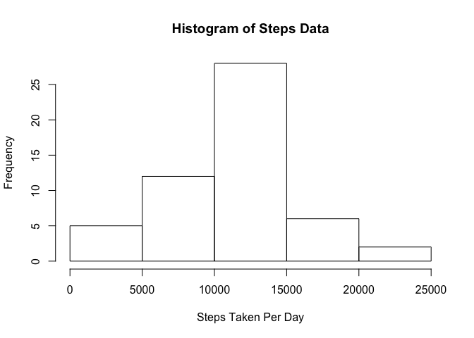
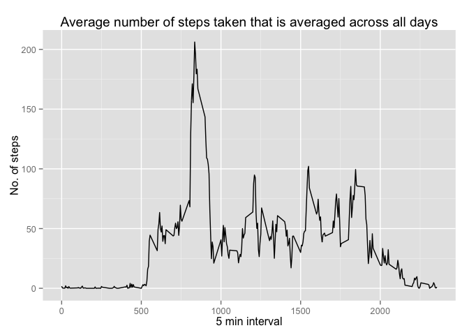
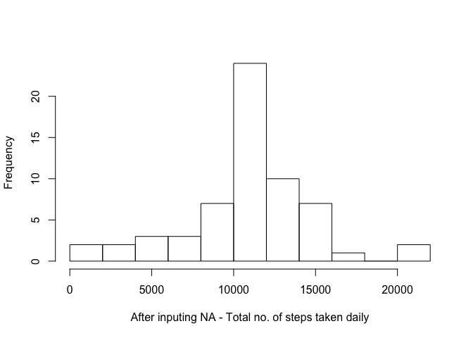
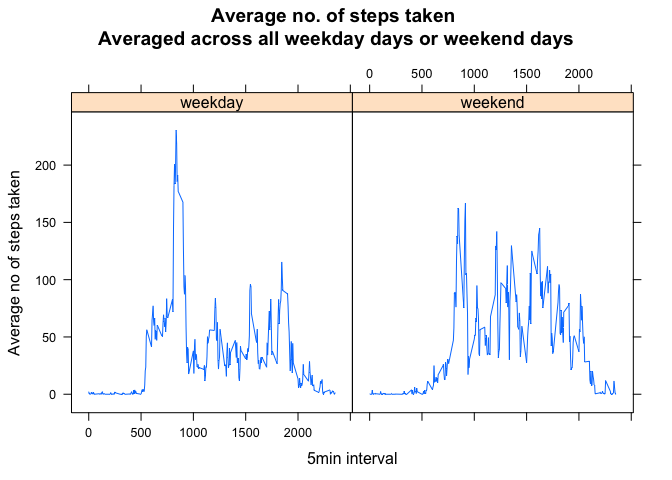

# Peer Assessment 1
Lim Chong Hoong  
19 July 2015  

## Loading and Preprocessing the data


```r
dat <- read.csv("./activity.csv", header = T, sep = ",")

# convert the "date" column data to Date type
dat$date <- as.Date(dat$date) 
```

## What is the mean total number of steps taken per day?

Calculate the total number of steps taken per day 


```r
# ignore NAs
dat_without_NA <- na.omit(dat)

# sum up the rows for the steps column grouped according to the date column
stepsData <- rowsum(dat_without_NA$steps, format(dat_without_NA$date, '%Y-%m-%d'))

# convert to a data frame
stepsData <- data.frame(stepsData)

# populate a name for the column
names(stepsData) <- ("StepsTakenPerDay")

# output the steps data
stepsData
```

```
##            StepsTakenPerDay
## 2012-10-02              126
## 2012-10-03            11352
## 2012-10-04            12116
## 2012-10-05            13294
## 2012-10-06            15420
## 2012-10-07            11015
## 2012-10-09            12811
## 2012-10-10             9900
## 2012-10-11            10304
## 2012-10-12            17382
## 2012-10-13            12426
## 2012-10-14            15098
## 2012-10-15            10139
## 2012-10-16            15084
## 2012-10-17            13452
## 2012-10-18            10056
## 2012-10-19            11829
## 2012-10-20            10395
## 2012-10-21             8821
## 2012-10-22            13460
## 2012-10-23             8918
## 2012-10-24             8355
## 2012-10-25             2492
## 2012-10-26             6778
## 2012-10-27            10119
## 2012-10-28            11458
## 2012-10-29             5018
## 2012-10-30             9819
## 2012-10-31            15414
## 2012-11-02            10600
## 2012-11-03            10571
## 2012-11-05            10439
## 2012-11-06             8334
## 2012-11-07            12883
## 2012-11-08             3219
## 2012-11-11            12608
## 2012-11-12            10765
## 2012-11-13             7336
## 2012-11-15               41
## 2012-11-16             5441
## 2012-11-17            14339
## 2012-11-18            15110
## 2012-11-19             8841
## 2012-11-20             4472
## 2012-11-21            12787
## 2012-11-22            20427
## 2012-11-23            21194
## 2012-11-24            14478
## 2012-11-25            11834
## 2012-11-26            11162
## 2012-11-27            13646
## 2012-11-28            10183
## 2012-11-29             7047
```

Make a histogram of the total number of steps taken each day


```r
hist(stepsData$StepsTakenPerDay, main = "Histogram of Steps Data", xlab = "Steps Taken Per Day")
```

 

Calculate and report the mean and median of the total number of steps taken per day


```r
mean(stepsData$StepsTakenPerDay)
```

```
## [1] 10766.19
```

```r
median(stepsData$StepsTakenPerDay)
```

```
## [1] 10765
```

## What is the average daily activity pattern?

Make a time series plot (i.e. type = "l") of the 5-minute interval (x-axis) and the average number of steps taken, averaged across all days (y-axis)


```r
library(plyr)

# Calculate average steps for each of 5-minute interval during a 24-hour period
# summarise the data that is grouped by the "interval" column, using the mean function
intervalMeanStepsData <- ddply(dat_without_NA, "interval", summarise,  mean=mean(steps))

library(ggplot2)

qplot(x=interval, y=mean, data = intervalMeanStepsData,  geom = "line", xlab="5 min interval", ylab="No. of steps", main="Average number of steps taken that is averaged across all days")
```

 

Which 5-minute interval, on average across all the days in the dataset, contains the maximum number of steps?


```r
intervalMeanStepsData[which.max(intervalMeanStepsData$mean), 1]
```

```
## [1] 835
```

## Inputing missing values
Note that there are a number of days/intervals where there are missing values (coded as NA). The presence of missing days may introduce bias into some calculations or summaries of the data.

Calculate and report the total number of missing values in the dataset (i.e. the total number of rows with NAs)


```r
length(which(is.na(dat) == TRUE))
```

```
## [1] 2304
```

Devise a strategy for filling in all of the missing values in the dataset. The strategy does not need to be sophisticated. For example, you could use the mean/median for that day, or the mean for that 5-minute interval, etc.

Create a new dataset that is equal to the original dataset but with the missing data filled in.


```r
library(sqldf)
```

```
## Loading required package: gsubfn
## Loading required package: proto
```

```
## Warning in doTryCatch(return(expr), name, parentenv, handler): unable to load shared object '/Library/Frameworks/R.framework/Resources/modules//R_X11.so':
##   dlopen(/Library/Frameworks/R.framework/Resources/modules//R_X11.so, 6): Library not loaded: /opt/X11/lib/libSM.6.dylib
##   Referenced from: /Library/Frameworks/R.framework/Resources/modules//R_X11.so
##   Reason: image not found
```

```
## Could not load tcltk.  Will use slower R code instead.
## Loading required package: RSQLite
## Loading required package: DBI
```

```r
## join the original data df with the mean of intervalMeanStepsData df based on the Date and Interval value
sqlTableData <- sqldf('SELECT sqlData.*, intervalSqlData.mean FROM "intervalMeanStepsData" as intervalSqlData JOIN "dat" as sqldata ON sqldata.interval = intervalSqlData.interval ORDER BY sqlData.date, sqlData.interval ') 

## fill with the mean where steps is NA
sqlTableData$steps[is.na(sqlTableData$steps)] <- sqlTableData$mean[is.na(sqlTableData$steps)]

## create a new df with date and total steps column after the NA are filled in
newTotalStepsOrderedByDate <- sqldf('SELECT date, sum(steps) as "Total_Steps" FROM sqlTableData GROUP BY date ORDER BY date');

newDataSet <- sqldf('SELECT date, Total_Steps as "steps" FROM "newTotalStepsOrderedByDate" ORDER BY date');
```

Make a histogram of the total number of steps taken each day and Calculate and report the mean and median total number of steps taken per day. Do these values differ from the estimates from the first part of the assignment? What is the impact of imputing missing data on the estimates of the total daily number of steps?


```r
hist(newDataSet$steps, main=" ", breaks=10, xlab="After inputing NA - Total no. of steps taken daily")
```

 

=> Not much difference from the data in the first assignment 


```r
newTotalSteps <- as.integer( sqldf('SELECT sum(steps) FROM sqlTableData') );
meanStepsPerDay <- as.integer(newTotalSteps / NROW(newTotalStepsOrderedByDate) )
meanStepsPerDay
```

```
## [1] 10766
```

```r
medianStepsPerDay <- median(newTotalStepsOrderedByDate$Total_Steps)
medianStepsPerDay
```

```
## [1] 10766.19
```

## Are there differences in activity patterns between weekdays and weekends?

Create a new factor variable in the dataset with two levels - "weekday" and "weekend" indicating whether a given date is a weekday or weekend day.


```r
sqlTableData$weektime <- as.factor(ifelse(weekdays(sqlTableData$date) %in% c("Saturday","Sunday"),"weekend", "weekday"))

dat2 <- sqldf('SELECT interval, avg(steps) as "mean.steps", weektime FROM sqlTableData GROUP BY weektime, interval ORDER BY interval ')
```

Make a panel plot containing a time series plot (i.e. type = "l") of the 5-minute interval (x-axis) and the average number of steps taken, averaged across all weekday days or weekend days (y-axis). See the README file in the GitHub repository to see an example of what this plot should look like using simulated data.


```r
library("lattice")
newPlot <- xyplot(mean.steps ~ interval | factor(weektime), data=dat2, type = 'l', main="Average no. of steps taken \nAveraged across all weekday days or weekend days", xlab="5min interval", ylab="Average no of steps taken")
print (newPlot)    
```

 
